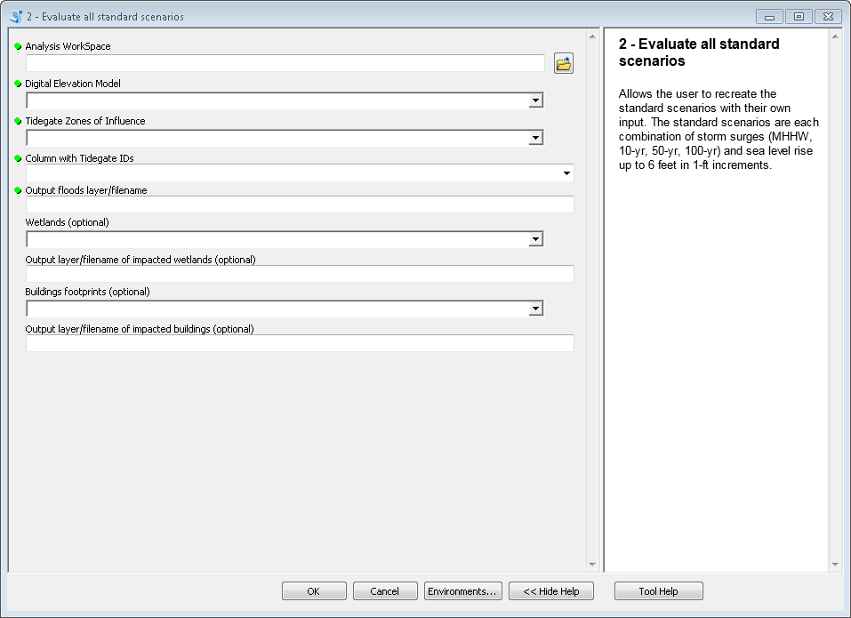
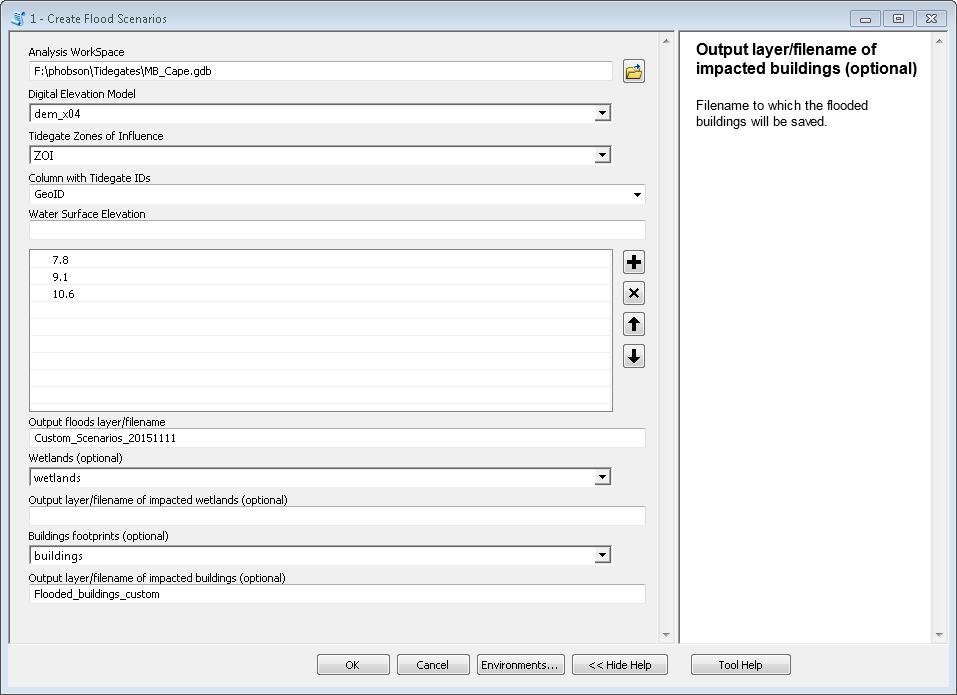

.. _arcgis:

Using **python-tidegates** as a python-toolbox in ArcGIS
====================================================

Finding the toolbox
--------------------
After you download (or clone) the source  (see :ref:`install instructions <install>`), you can navigate to the source directory in ArcCatalog:

.. figure:: images/toolbox_in_catalog.png
   :scale: 100 %
   :alt: Finding the toolbox in ArcCatalog
   :align: center
   :figwidth: image

   An ArcCatalog window after navigating to the source code of **python-tidegates**.

At this point you can double click either of the tools to use them.

   An empty form for the toolbox titled *1 - Create flood scenarios*.

   An empty form for the toolbox titled *2 - Evaluate all standard scenarios*.

Inputs to the toolboxes
-----------------------

Both toolboxes take identical parameters with one exeception:
the toolbox titled *1 - Create flood scenarios* allows the user to input multiple elevations to be analyzed.
In contrast, the form titled *2 - Evaluate all standard scenarios* automatically evaluates all of the elevations associated with the so-called "standard scenarios".
These include all of the combinations of sea level rise in 1-ft increments from 0 to 6 ft MSL, and storm surges events including:

   1. Mean higher high water
   2. 10-yr storm surge
   3. 50-yr storm surge
   4. 100-yr storm surge.

Common input parameters
~~~~~~~~~~~~~~~~~~~~~~~

The following are the parameters shared by both toolboxes.
All parameters are required except where noted.

Analysis Workspace (**workspace**)
    This is the folder or geodatabase that contains all of the input for the analysis.

    .. note: All of the input for the analysis (see below) *must* be in this workspace.

Digital Elevation Model (**dem**)
    This is the raster dataset that contains the gridded topographic and bathymetric data that will be used to determine the extent of flooding.
    The original geodatabases provided contain DEMs: one at 4-m, and a second at 8-m resolution.
    The finer resolution DEM provides more detailed output, however it also requires more runtime and the analysis requires more computational resources.
    If the tool runs into a ``MemeoryError`` during an analysis, try using the lower resolution raster.
    If these errors persist, Other things to try include limiting the number of **zones** analyzed or reducing the resolution of the raster even further.

    .. note: The elevations of the DEMs provided in the standard geodatabase are measured in meters.
             However, care is taken to convert the properly convert the user input into meters to match the DEM when determining the extent of flooding.

Tidegate Zone of Influence (**zones**)
    This is a polygon layer found in *workspace* that delineates the zone of influence of each tidegate.
    The original geodatabases provided include a dataset called "ZOI" that incclude this information.

Column with Tidegate IDs (**ID_column**)
    This is the name of the field in the **zones** parameter that contains the unique idenifier of each tidegate.
    When using the "ZOI" layers provided in the geodatabases, this should be set to "GeoID".

Output floods layer/filename (**flood_output**)
    This is the filename to which the extent of flooding will be saved withing **workspace**.

    .. warning: Both toolboxes will overwrite any previous output if duplicate filenames are provided.

Wetlands, optional (**wetlands**)
    This is a polygon layer found within **workspace** that delineates wetlands within a study area.
    If provided, the area of wetlands inundated during each flood scenario will be added to the **flood_output** layer.

Output layer/filename of impacted wetlands, optional (**wetlands_output**)
    This is the filename of the layer created by computing the intersections of **flood_output** and **wetlands**.
    The result is a shapefile/feature class that contains only the inundated areas of the wetlands.
    If **wetlands_output** is not provided, the information is not saved to disk.

    .. warning: Both toolboxes will overwrite any previous output if duplicate filenames are provided.

Building footprints, optional (**buildings**)
    This is a polygon layer of the building footprints in the study area.
    If provided the *number* of impacted buildings will be added to each record of **flood_output**.

Output layer/filename of impacted buildings, optional (**building_output**)
    This is the filename of an output layer that contains all of the impacted buildings for each flood scenario.
    If **building_output** is not provided, the information is not saved to disk.

    .. warning: Both toolboxes will overwrite any previous output if duplicate filenames are provided.

Custom elevations
~~~~~~~~~~~~~~~~~
The toolbox titled *1 - Create flood scenarios* allows the user to input multiple elevations to be analyzed.
Thus, it has an `elevation` user-input parameters that is not used by *2 - Evaluate all standard scenarios*.
In keeping with the formatted definitions below:

Water Surface Elevation (`elevation`)
    A series of multiple custom flood elevations (in feet MSL) to be analyzed.

Examples of filled out forms
----------------------------

   A completed form for the toolbox titled *1 - Create flood scenarios*.
   Note that some, but not all, of the optional input parameters are specified.

.. figure:: images/stdscen_filled.png
   :scale: 100 %
   :alt: Finding the toolbox in ArcCatalog
   :align: center
   :figwidth: image

   An completed form for the toolbox titled *2 - Evaluate all standard scenarios*.
   Note that some, but not all, of the optional input parameters are specified.

Other ways of using **python-tidegates**
----------------------------------------
Since **python-tidegates** is a python-based toolbox for ArcGIS, great care was taken to create the tool such that it could be called from python without opening ArcMap or ArcCatalog.
Using the tools from a python intepreter is described in :ref:`the next section <python>`.
